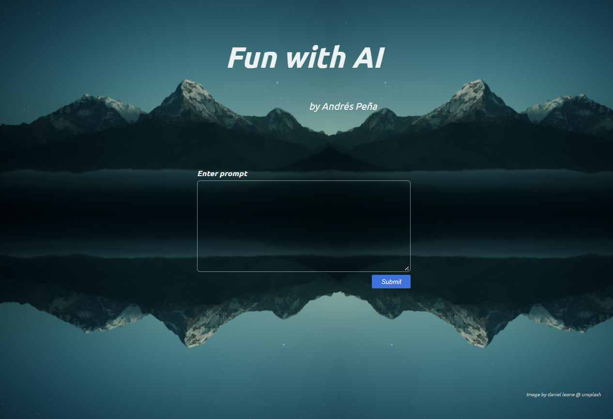
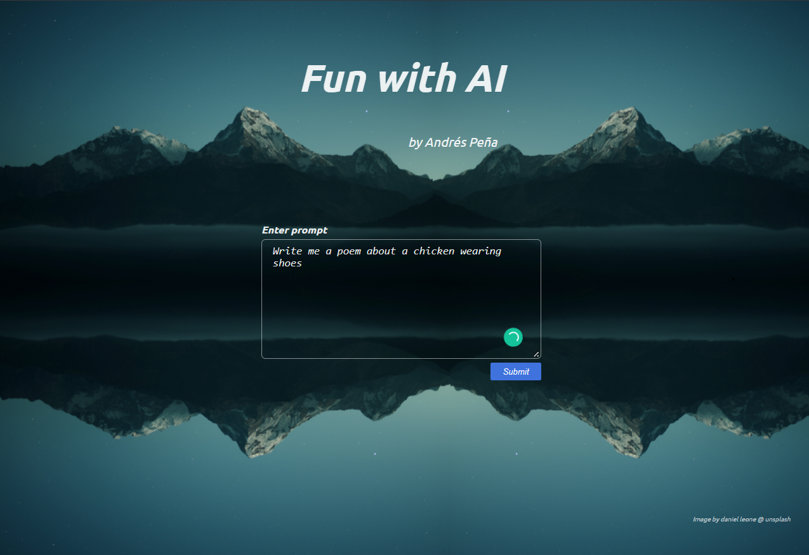
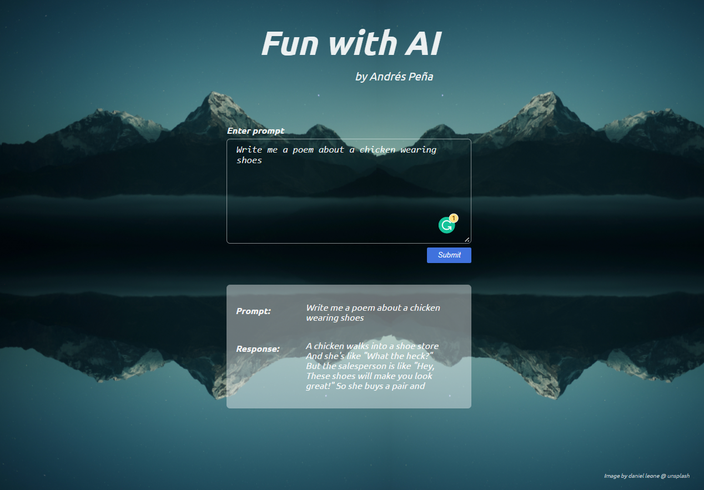
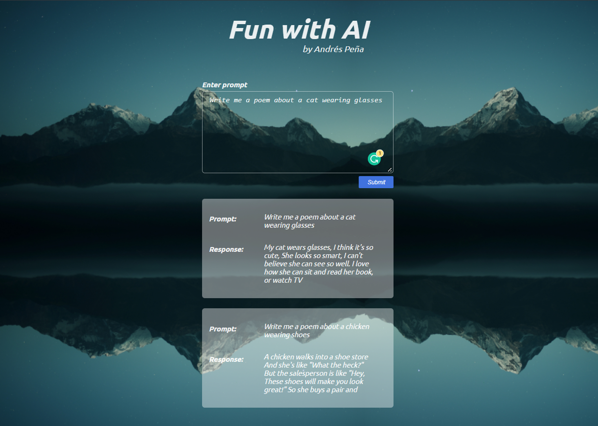

## <aifun>

## Table of Contents

  - [Description](#description)
  - [Installation](#installation)
  - [Usage](#usage)
  - [Credits](#credits)
  - [GitHub](#github)
  - [Features](#features)

## Description

This application allows the user to explore advances in AI capabilities of processing test, by submitting a prompt to the openAI API and receiving responses that are displayed in a list of cards.

1. This web application will allow users to enter a prompt to the openAI API 
2. Once the prompt is submitted, the application will display a response card with the openAI completion
3. The newest completion will be displayed on top of previous responses
4. The data will be stored in LocalStorage so that it will remain if the tab is refreshed

The USER STORY goes as follow

    AS A user
    I WANT to explore the AI capabilities to manipulate text while having fun 
    SO THAT I can stay up to date on advances for automating text processing.  

## Installation

No installation is needed. This application runs in a live webpage.

## Usage

To use this application, go to the deployed webpage by followig this link: [Visit the deployed page](https://andres-aifun.netlify.app/)

Once in the landing page, click on the text-box and enter a text with instructions for the program on what you want it to write, then click 'submit'. An example of a request would be "write me a poem about a chicken wearing shoes", or "explain life to a toddler". You can ask it anything! The more specific your request, with adjectives and examples, the better the response!

After clicking 'submit', a response will be shown in cards below the text-box. 

The cards will be stacked from newest to oldest and will remain even if the page is refreshed.

## Credits

Third-party assets:
- [React](https://reactjs.org/)
- [Google Fonts](https://fonts.google.com/)
- [npm](https://www.npmjs.com/)
- [dotenv-npm](https://www.npmjs.com/package/dotenv)
- [Netlify](https://www.netlify.com/) 
- [GitHub](https://github.com/) 

Reference material:
- [openAI](https://beta.openai.com/docs/guides/completion/introduction)
- [w3schools](https://www.w3schools.com/)
- [StackOverflow](https://stackoverflow.com/)
- [Mozilla Developer Network](https://developer.mozilla.org/en-US/)

## GitHub

If you want to know more details, feel free to [visit the repo](https://github.com/aj-pena/aifun.git)

## Features

- React
- Environment Variables
- Google Fonts and Fontawesome fonts and icons
- LocalStorage
- openAI API
- Dependencies:
  - dotenv 10.0.0
- Netlify
- GitHub
  
